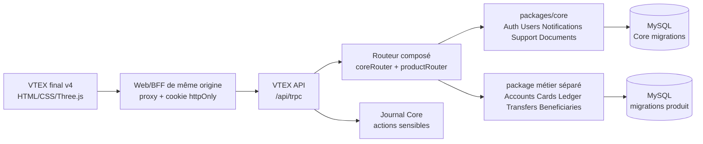

# Audit d’architecture et plan de raccordement — VTEX final v4 ↔ VTEX Core

**Auteur :** Manus AI  
**Date :** 13 août 2026  
**Périmètre :** `Acut-VTEX-Core-extracted.zip` et `vtex_final_v4.zip` contenus dans `Pouraujourd’hui.zip`.

## 1. Conclusion exécutive

L’archive contient deux projets de nature très différente. Le premier est un monorepo pnpm/TypeScript qui fournit un **Core serveur réel** : base MySQL, migrations Drizzle, authentification, sessions, RBAC, API tRPC, Dashboard Next.js et déploiement Docker. Le second est une **démo front statique autonome**, très travaillée visuellement, composée d’un fichier HTML monolithique, d’un moteur Three.js et de quelques fichiers de déploiement statique.

La frontière technique est saine du côté du Core : les anciens packages et applications Wallet ne sont plus présents dans le runtime, et `packages/router/src/index.ts` expose désormais le routeur Core seul. La vraie difficulté n’est donc pas de « reconnecter » deux backends existants, mais de **transformer VTEX final v4 en client d’une API serveur** et de construire séparément le domaine financier nécessaire à ses cartes, soldes, virements, bénéficiaires et transactions.

> **Décision structurante :** le Core doit rester transverse. L’authentification, l’identité, les notifications, le support, les documents et les paramètres peuvent être consommés directement par VTEX final v4. Les comptes financiers, cartes, soldes et opérations doivent être implémentés dans un routeur et un schéma métier séparés, composés avec `coreRouter`, jamais réintroduits dans `@vtex/core`.[^1][^2]

## 2. Inventaire des deux projets

| Projet | Nature | Taille observée | Entrée principale | État actuel |
| --- | --- | ---: | --- | --- |
| `Acut-VTEX-Core-extracted` | Monorepo pnpm, TypeScript, Next.js, tRPC, Drizzle, MySQL | 203 fichiers source/documentation avant génération | `apps/api`, `apps/dashboard`, `packages/core` | Backend transverse compilable, sans domaine financier runtime |
| `vtex_final_v4` | Site statique HTML/CSS/JavaScript | 12 fichiers, dont `index.html` de 5 966 lignes | `index.html` | Démo interactive avec données et auth simulées côté navigateur |

Le Core est organisé en deux applications et quatre packages principaux. `apps/api` monte l’API tRPC Next.js sur `/api/trpc`, `apps/dashboard` fournit l’interface d’administration, `packages/core` porte les services et le schéma, `packages/router` expose la façade de composition, `packages/money` fournit les montants entiers et `packages/ui` les tokens CSS.[^3][^4]

VTEX final v4 n’a ni `package.json`, ni bundler, ni serveur applicatif, ni base de données. `three.min.js` est embarqué localement, tandis que les polices, icônes et le QR code utilisent des ressources externes. Le fichier `vtex3d.js` est une couche de rendu dépendante des variables globales déclarées dans `index.html`, notamment `CARDS`, `fmtEUR`, `activeCardIndex` et `goToCard`.[^5][^6]

## 3. Cartographie du Core

### 3.1 Surface de contrats disponible

Le routeur Core actuel expose neuf branches : `auth`, `users`, `notifications`, `leads`, `analytics`, `settings`, `support`, `journal` et `documents`. Le routeur ne contient plus de branches `wallets`, `cards`, `transactions` ou `goals`.[^1]

| Branche Core | Capacités observées | Utilisation cible dans VTEX final v4 |
| --- | --- | --- |
| `auth` | Login mot de passe, OTP, logout, sessions, reset password, Passkeys/WebAuthn | Remplacer le faux login et le faux OTP ; gérer les appareils et la session |
| `users` | Profil courant, mise à jour, création et administration, suspension, RBAC | Alimenter Profil, identité, état KYC et informations personnelles |
| `notifications` | Liste utilisateur, compteur non lu, marquage lu | Remplacer les notifications codées en dur et le compteur « 3 alertes » |
| `leads` | CRUD, notes, conversion générique en utilisateur | Non prioritaire pour le front financier, mais conservé côté Dashboard |
| `analytics` | Funnel de leads générique | Ne doit pas recevoir les métriques financières du nouveau produit par défaut |
| `settings` | Réglages publics et administration | Nom, logo, maintenance, support et configuration générale |
| `support` | Tickets, messages, statut et priorité | Remplacer le brouillon `mailto:` par de vrais tickets si souhaité |
| `journal` | Journal d’audit immuable, accès administrateur | Auditer les actions sensibles du futur domaine financier |
| `documents` | Documents utilisateur et lecture contrôlée | Reçus, justificatifs et documents KYC, après définition du contrat métier |

### 3.2 Authentification et session

Le contrat réel de connexion est différent de celui simulé dans VTEX final v4. `auth.login` attend `{ email, password }`, déclenche un OTP et renvoie `{ userId, requiresOtp: true }`. `auth.verifyOtp` attend un code de **six caractères**, éventuellement un nom d’appareil, puis renvoie `{ token }`.[^7]

Le Dashboard fournit déjà un pattern de sécurité réutilisable : une route serveur appelle `auth.verifyOtp`, pose le token dans le cookie `vtex_session` avec les attributs `httpOnly`, `sameSite: "lax"`, `secure` en production et `path: "/"`, puis un proxy serveur lit ce cookie et transmet `Authorization: Bearer …` à l’API.[^8][^9]

Cette approche doit être préférée au stockage du token dans `localStorage` ou dans une variable JavaScript persistante. Si `vtex_final_v4` reste un site statique servi sur une origine distincte, il faudra soit le placer derrière un BFF/proxy de même origine, soit créer une couche serveur minimale qui reproduit le bridge OTP et le proxy tRPC du Dashboard.

### 3.3 Schéma et migrations

Le schéma Core contient les tables d’identité et de support : utilisateurs, sessions, notifications, lectures de notifications, leads, réglages, tickets, journal, rate limiting, OTP et WebAuthn. Le module Documents est générique dans le code mais utilise encore physiquement `wallet_documents` pour préserver les données existantes sans renommage destructif.[^10]

Cette dernière table est une **compatibilité de stockage**, pas un signe qu’il faut réintroduire un package Wallet dans le Core. De même, les noms `wallet` de la base et du volume Docker Hostinger sont documentés comme historiques pour conserver une continuité de volume ; ils n’ont pas été renommés automatiquement, car un tel changement exigerait une migration et une stratégie de reprise explicites.[^11]

## 4. Cartographie de VTEX final v4

### 4.1 Organisation front

`index.html` regroupe le markup de toutes les vues, les styles, les modèles de données, les handlers d’événements, l’authentification simulée, les mutations financières locales et le rendu des reçus. La navigation `showView` commute des écrans identifiés par `view-*`, avec des écrans de connexion, OTP, accueil, cartes, historique, notifications, profil, support, banque, bénéficiaires, virements, partage de fonds, transfert entre cartes et reçu.[^5]

`vtex3d.js` doit être considéré comme une **vue spécialisée**, non comme un module métier. Il dessine les cartes et synchronise leur rendu avec les globales de la page. Son adaptation future doit recevoir un modèle de carte déjà filtré et non sensible ; il ne doit jamais devenir une source de vérité pour le solde ou le statut d’une opération.[^6]

### 4.2 Données simulées et mutations locales

Le front initialise deux cartes dans `CARDS`, douze transactions dans `TRANSACTIONS` et quatre bénéficiaires dans `BENEFICIAIRES`. Les soldes sont des nombres JavaScript en unités majeures, les devises utilisent un taux local fixe EUR/XPF, et les formulaires modifient directement les objets en mémoire. Aucun de ces changements n’est envoyé au serveur, persisté dans un cookie, sauvegardé dans `localStorage` ou restauré après rechargement.[^5]

| Fonction de la démo | Mécanisme actuel | Conséquence pour l’intégration |
| --- | --- | --- |
| Login | `submitLogin` affiche directement l’OTP | Appeler `auth.login`, conserver `userId` temporaire et traiter les erreurs serveur |
| OTP | Code local de quatre chiffres puis succès automatique | Passer à six chiffres et appeler `auth.verifyOtp` via un bridge serveur |
| Profil | Nom, email, sécurité et date d’adhésion codés en dur | Utiliser `users.getMe`, `auth.listSessions` et les contrats WebAuthn |
| Notifications | Cinq exemples statiques | Utiliser `notifications.listMine`, `unreadCount`, `markRead` et `markAllRead` |
| Support | FAQ + composition `mailto:` | Garder la FAQ en contenu statique ou créer des tickets avec `support.create` |
| Confidentialité/KYC | Texte d’information, aucune action réelle | Utiliser `documents` pour les justificatifs et `support` pour les demandes assistées |
| Informations bancaires | IBAN, BIC, titulaire et QR code codés en dur | Contrat financier serveur, données sensibles filtrées, QR généré localement ou par backend |
| Cartes | PAN, CVV, limites, gel et toggles en mémoire | Nouveau domaine métier, droits fins, ne jamais exposer de secrets complets au front |
| Solde | Somme locale de `CARDS[*].balance` | Lecture serveur atomique et formatage côté client seulement |
| Virement externe | Débit local, reçu local et identifiant aléatoire | Mutation serveur idempotente, journal, statut et document de reçu côté serveur |
| Virement classique | Débit immédiat même pour une programmation ou récurrence | Modèle de paiements planifiés et worker/scheduler à définir séparément |
| Partage de fonds | Calcul et débit local sans ordre persistant | Contrat de demande de partage, participants, statut et notification |
| Transfert entre cartes | Deux soldes modifiés directement | Transaction DB atomique avec contrôle de propriété et devise |

### 4.3 Risques fonctionnels et de sécurité

Le faux OTP du front utilise quatre chiffres, alors que le Core exige six chiffres. Ce point empêchera la connexion dès le premier branchement si l’écran n’est pas adapté.[^5][^7]

La démo embarque des numéros de carte complets, des CVV, des IBAN et un BIC. Même s’il s’agit de données de démonstration, leur présence dans une page publique créerait une mauvaise frontière de sécurité et risquerait d’être copiée dans des captures, caches ou journaux. La version production doit recevoir uniquement des données masquées et des capacités contrôlées par le serveur.

Les fonctions `submitSend`, `submitClassique`, `submitSplit` et `submitTransfertCartes` débloquent ou débitent des soldes en mémoire. Le virement de montant élevé est même marqué comme « en attente » dans l’interface tout en débitant localement la carte ; cette règle ne peut pas être considérée comme une logique financière fiable. Le backend devra décider du statut, du moment du débit, des frais, de l’idempotence et de la confirmation.

La conversion EUR/XPF est également effectuée avec des nombres flottants et un taux codé dans la page. Le package `@vtex/money` du Core impose au contraire une représentation entière et un formatage par devise. Le nouveau domaine financier devra stocker les montants dans l’unité minimale appropriée et ne laisser au front que la présentation.[^12]

Le QR code est chargé depuis `api.qrserver.com` avec un IBAN figé. Cela introduit une dépendance externe, une fuite de données bancaires dans l’URL et un comportement non déterministe en cas de blocage CSP ou d’indisponibilité du service. Un QR EPC doit être construit à partir des données serveur et généré localement ou servi par une route contrôlée.

## 5. Matrice de raccordement cible

| Étape | Source actuelle | Cible recommandée | Priorité | Dépendance |
| --- | --- | --- | ---: | --- |
| Session | Faux login/OTP client | Bridge serveur + `auth.login`/`auth.verifyOtp` + cookie `httpOnly` | P0 | Origine/proxy |
| Profil | Données statiques | `users.getMe`, `users.updateMe`, `auth.listSessions` | P0 | Session |
| Shell applicatif | `showView` et état global | Garder le rendu, introduire un store d’état asynchrone minimal | P0 | Session |
| Notifications | Markup fixe | `notifications.listMine`, compteur, lecture | P1 | Session |
| Support | `mailto:` | `support.listMine`, `support.create`, `support.reply` | P1 | Session |
| Documents | Aucun backend utilisé | `documents.listMine` et `documents.getMine` | P1 | Session, stockage |
| Cartes | `CARDS` global | Nouveau package financier, cartes non sensibles, limites serveur | P0 | Schéma financier |
| Soldes | `balance` flottant | Comptes/ledger côté serveur, montants entiers | P0 | Package `@vtex/money` |
| Transactions | `TRANSACTIONS` constant | Ledger et historique paginés | P0 | Schéma financier |
| Bénéficiaires | `BENEFICIAIRES` global | CRUD protégé, validation IBAN côté serveur | P1 | Session |
| Virements | Débit local et reçu local | Ordre idempotent, frais, statut, audit, notification | P0 | Ledger, journal |
| RIB/QR | Données bancaires en dur | Contrat financier filtré, génération EPC contrôlée | P1 | Compte bancaire |
| 3D | Globales `CARDS` | Adaptateur de vue `CardViewModel` | P2 | API cartes |
| Déploiement | Site statique indépendant | Même origine ou BFF/proxy contrôlé | P0 | Infrastructure |

## 6. Architecture cible proposée

Le montage recommandé est une application web de même origine que le BFF, ou un reverse proxy qui expose les routes d’authentification et `/api/trpc` sous le domaine du client. Le navigateur n’a ainsi pas besoin de connaître l’URL interne de l’API ni de persister un JWT. Si un appel cross-origin est retenu temporairement, `ALLOWED_ORIGINS` doit contenir l’origine réelle de VTEX final v4 et le proxy doit transmettre explicitement le Bearer token.[^8][^9]

Le domaine financier doit être séparé du Core. Il pourra être nommé selon le produit final, mais il doit contenir son propre schéma, ses migrations, ses services, ses tests d’autorisation et un `productRouter`. Le routeur final composera ensuite les branches Core et produit. La séparation ne doit pas être seulement conventionnelle : chaque mutation financière doit vérifier la propriété, le rôle, les limites, l’état du compte et l’idempotence côté serveur.

## 7. Séquence d’implémentation recommandée

**Phase A — Stabiliser le shell et la session.** Il faut d’abord intégrer `auth.login`, `auth.verifyOtp`, `logout` et la récupération de l’utilisateur courant. Le flux OTP doit passer à six chiffres, afficher les erreurs serveur et ne révéler aucun code de production. Le front doit obtenir un état `booting/authenticated/anonymous` avant de rendre les vues sensibles.

**Phase B — Brancher les fonctionnalités Core non financières.** Les vues Profil, Notifications, Support et Documents peuvent alors être raccordées aux contrats existants. Les données statiques doivent devenir des états de chargement, d’erreur et de succès ; les vues ne doivent plus supposer que l’utilisateur est `Ariel Koudjo` ou que trois notifications existent.

**Phase C — Construire le domaine financier.** Avant de remplacer `CARDS` et `TRANSACTIONS`, il faut figer les invariants métier : comptes, cartes, unités monétaires, ledger, transfert interne, virement externe, bénéficiaires, frais, plafonds, ordres programmés, récurrence, statut pending/confirmed/rejected et modèle de reçu. Les opérations doivent être transactionnelles et idempotentes.

**Phase D — Remplacer progressivement les mocks.** Chaque fonction `render*` doit recevoir un modèle API normalisé. Les fonctions de mutation ne doivent plus modifier directement les constantes globales ; elles doivent appeler un contrat, invalider/recharger les données et laisser la couche de rendu afficher le résultat serveur. L’interface 3D peut rester visuellement inchangée si son adaptateur conserve les champs nécessaires au rendu.

**Phase E — Sécuriser et valider.** Il faudra supprimer PAN/CVV/IBAN de démonstration, supprimer le QR externe, ajouter une CSP, valider les permissions utilisateur/admin, tester les replays de mutation, couvrir les erreurs réseau et exécuter les tests avec une vraie base MySQL/MariaDB initialisée par migrations. Les montants devront être testés en EUR, USD et XPF sans flottants.

## 8. Nettoyage appliqué au Core

Le nettoyage réalisé dans la copie de travail ne supprime aucune donnée ni migration. Les anciens rapports, inventaires et scripts d’extraction ont été déplacés sous `docs/archive/legacy-extraction/` afin de les conserver pour traçabilité sans les laisser à la racine du runtime. Les commentaires et tests qui citaient explicitement l’ancien package ont été généralisés.

Les exemples CORS et WebAuthn de `packages/core/.env.example` utilisent désormais `app.vtex.app` au lieu de l’ancien sous-domaine Wallet. Le test CORS Core et le test du Route Handler API ont été alignés. Le libellé d’appareil de session du Dashboard est devenu `VTEX Core Dashboard Web`, et les textes alternatifs du logo indiquent désormais `VTEX Core`.

Les éléments suivants ont volontairement été conservés : le nom physique `wallet_documents`, les noms de base et de volume Docker Hostinger `wallet` et `wallet_mysql_data`, ainsi que les anciens rapports déplacés. Les renommer sans plan de migration risquerait de casser la reprise de données ou le volume existant. Ils sont maintenant explicitement documentés comme compatibilités historiques et non comme dépendances runtime.

## 9. Validations effectuées

| Validation | Résultat | Interprétation |
| --- | --- | --- |
| Extraction et inventaire des deux ZIP imbriqués | Réussie | Les deux projets ont été analysés séparément dans une copie de travail |
| `pnpm install --ignore-scripts` | Réussi | Lockfile cohérent ; les artefacts `dist` n’étaient pas encore construits |
| `pnpm typecheck` initial | Échec attendu après installation sans scripts | Imports `dist` absents ; pas une erreur métier |
| Construction ordonnée Core → Router | Réussie | Les packages TypeScript se construisent |
| `pnpm typecheck` après build | Réussi | Packages, API et Dashboard compilent |
| `pnpm build` avant nettoyage | Réussi | API et Dashboard Next.js construisent |
| `pnpm typecheck` après nettoyage | Réussi | Les modifications sont statiquement sûres |
| `pnpm build` après nettoyage | Réussi | Aucun impact de build détecté |
| `pnpm test` | Non vert : 74 échecs, 14 succès sur 88 tests | Les tests qui interrogent Drizzle échouent car aucune instance MySQL/MariaDB locale n’est joignable dans l’environnement ; aucune base de validation n’était démarrée |

Le résultat des tests ne doit pas être présenté comme une validation fonctionnelle complète. Avant le branchement financier, il faudra démarrer une base dédiée, appliquer les migrations Core, relancer la suite puis ajouter les tests du routeur produit et les tests d’intégration du nouveau front.

## 10. Références internes

[^1]: [`packages/core/src/api/router.ts`](../packages/core/src/api/router.ts) — composition actuelle du routeur Core.
[^2]: [`README.md`](../README.md) — frontière publique et absence de domaine financier dans le Core.
[^3]: [`package.json`](../package.json) et [`pnpm-workspace.yaml`](../pnpm-workspace.yaml) — monorepo et scripts racine.
[^4]: [`apps/api/src/app/api/trpc/[trpc]/route.ts`](../apps/api/src/app/api/trpc/%5Btrpc%5D/route.ts) — endpoint HTTP tRPC et CORS.
[^5]: [`vtex_final_v4/index.html`](../../../vtex_final_v4/index.html) — vues, données simulées et mutations locales de VTEX final v4.
[^6]: [`vtex_final_v4/vtex3d.js`](../../../vtex_final_v4/vtex3d.js) — moteur Three.js et dépendances globales de rendu.
[^7]: [`packages/core/src/api/routers/auth.ts`](../packages/core/src/api/routers/auth.ts) — contrat exact login/OTP/session.
[^8]: [`apps/dashboard/src/app/api/auth/verify-otp/route.ts`](../apps/dashboard/src/app/api/auth/verify-otp/route.ts) — bridge OTP vers cookie `httpOnly`.
[^9]: [`apps/dashboard/src/app/api/trpc/[trpc]/route.ts`](../apps/dashboard/src/app/api/trpc/%5Btrpc%5D/route.ts) — proxy Bearer vers l’API Core.
[^10]: [`packages/core/src/db/schema.ts`](../packages/core/src/db/schema.ts) et [`packages/core/src/db/migrations/0004_extract_documents.sql`](../packages/core/src/db/migrations/0004_extract_documents.sql) — schéma Core et compatibilité `wallet_documents`.
[^11]: [`deployment/VARIABLES-HOSTINGER.md`](../deployment/VARIABLES-HOSTINGER.md) et [`deployment/docker-compose.hostinger.yml`](../deployment/docker-compose.hostinger.yml) — continuité de base et volume Hostinger.
[^12]: [`packages/money/src/index.ts`](../packages/money/src/index.ts) — montants entiers et formatage multi-devises.
